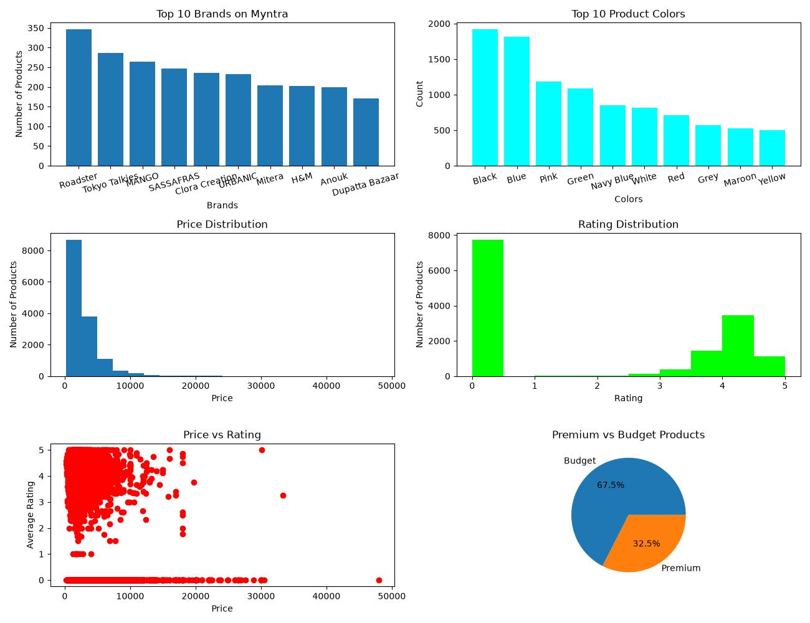
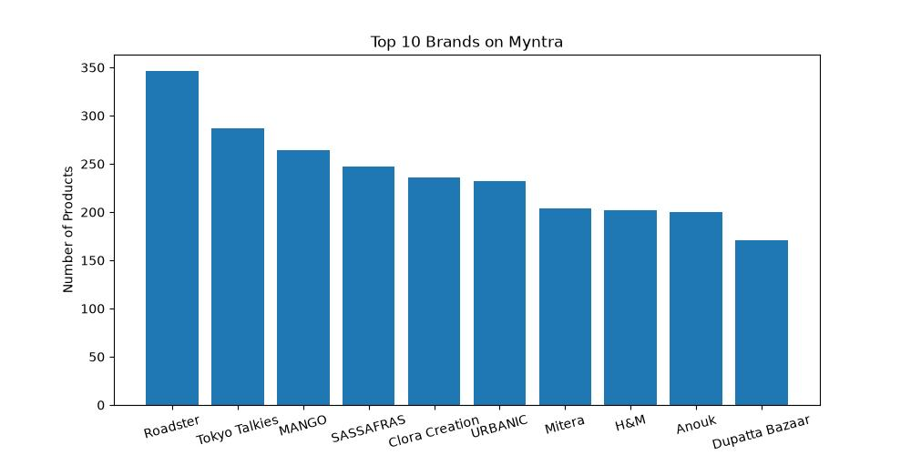
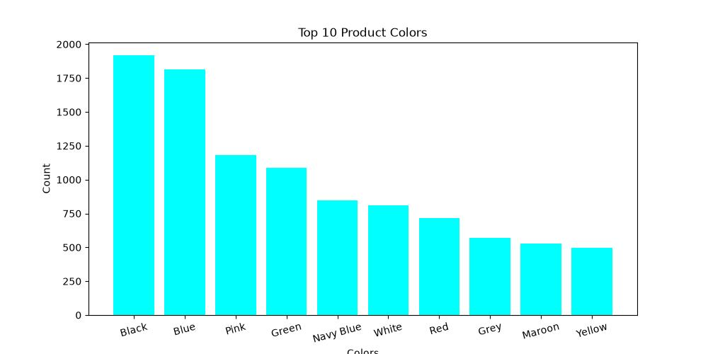
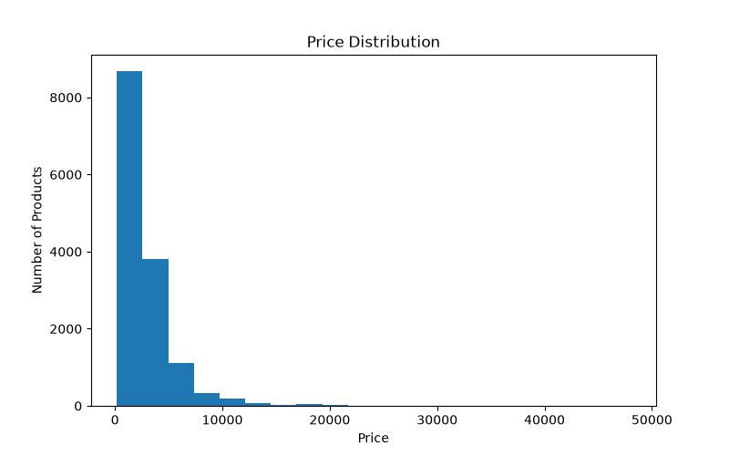
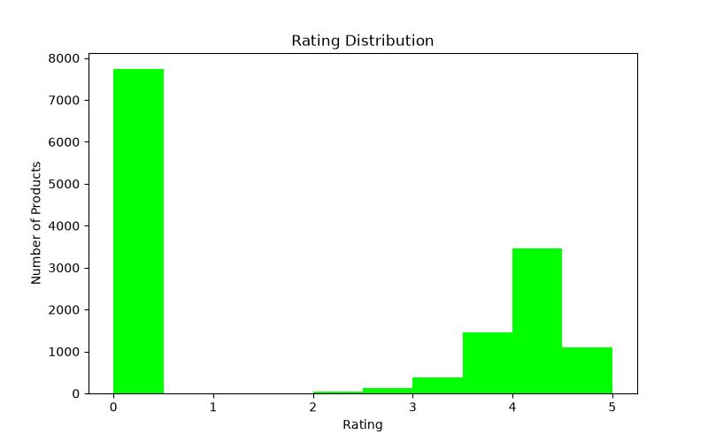
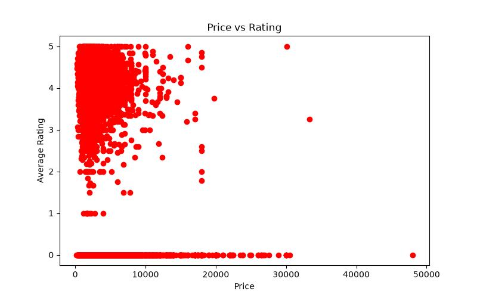
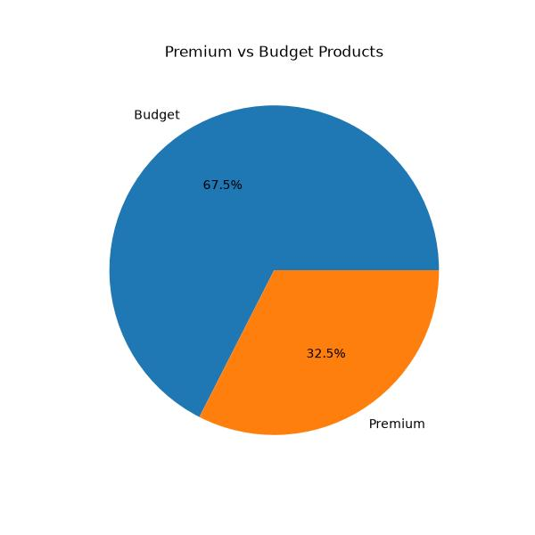

# 🛍️ Myntra Fashion Product Analysis

## 📌 Project Overview

This project focuses on analyzing Myntra fashion product data using Python. The objective of this project is to perform data cleaning, statistical analysis, feature engineering, and data visualization to gain meaningful insights from the dataset.

The analysis was performed using NumPy, Pandas, and Matplotlib, covering all the concepts learned during my Data Science learning journey.

---

## 🎯 Project Objectives

- Clean and preprocess raw fashion product data.
- Analyze product pricing patterns.
- Identify top brands available on Myntra.
- Analyze product color distribution.
- Study rating distribution among products.
- Compare product prices with ratings.
- Categorize products into Premium and Budget segments.
- Visualize insights using multiple chart types.
- This project was built as part of my Data Science learning journey to apply NumPy, Pandas, and Matplotlib on a real-world dataset.
---

## 🛠️ Technologies Used

- Python
- NumPy
- Pandas
- Matplotlib

---

## 📂 Dataset Information

Dataset Source: Kaggle Fashion Dataset
The dataset contains information about fashion products available on Myntra.

### Dataset Features

| Column Name | Description |
|------------|-------------|
| p_id | Product ID |
| name | Product Name |
| price | Product Price |
| colour | Product Color |
| brand | Brand Name |
| img | Product Image URL |
| ratingCount | Number of Ratings |
| avg_rating | Average Product Rating |
| description | Product Description |
| p_attributes | Product Attributes |

### Dataset Size

- Total Records: 14,330
- Records After Cleaning: 14,312
- Columns: 10

---

## 🧹 Data Cleaning Process

The following preprocessing steps were performed:

- Removed unnecessary index column (`Unnamed: 0`)
- Removed rows with missing critical product information
- Filled missing color values with `"Unknown"`
- Replaced missing rating counts with `0`
- Replaced missing average ratings with `0`
- Verified that the dataset contained no duplicate rows
- Validated the final dataset for analysis

---

## 📊 Statistical Analysis Using NumPy

The following statistical measures were calculated:

- Average Product Price
- Maximum Product Price
- Minimum Product Price
- Median Product Price
- Standard Deviation of Product Prices

Example Output:

```text
Average Price of Products : ₹2964.23

Maximum Price of Products : ₹47999.00

Minimum Price of Products : ₹169.00

Median Price of Products : ₹2200.00

Standard Deviation : ₹2563.76
```

---

## ⚙️ Feature Engineering

### Price Category

Products were categorized as:

- Premium Products
- Budget Products

using NumPy's `np.where()` function.

### Rating Category

Products were categorized as:

- High Rated
- Low Rated

based on their average rating.

---

## 📊 Project Visualizations

## Dashboard



### Top 10 Brands on Myntra



### Top 10 Product Colors



### Price Distribution



### Rating Distribution



### Price vs Rating



### Premium vs Budget Products


---

## 🔍 Key Insights

- Myntra offers products from a large number of fashion brands.
- Product prices vary significantly across different brands.
- Most products fall within an affordable to mid-range price segment.
- Higher product prices do not always result in higher ratings.
- Certain colors dominate the platform's product catalog.
- Both premium and budget segments are well represented.

---

## 📁 Project Structure

```text
Myntra-Fashion-Analysis/
│
├── Fashion Dataset.csv
├── Myntra.py
├── README.md
│
├── Images/
│   ├── Top_Brands.jpg
│   ├── Top_Colors.jpg
│   ├── Price_Distribution.jpg
│   ├── Rating_Distribution.jpg
│   ├── Scatter_Plot.jpg
│   └── Pie_Chart.jpg
```

---

## 🚀 Future Improvements

- Build an interactive dashboard using Streamlit.
- Perform brand-wise rating analysis.
- Analyze product attributes in detail.
- Add machine learning based product recommendations.

---

## 👨‍💻 Author

**Suraj Tiwari**

B.Tech Student | Data Science Enthusiast

- GitHub: [suraj-tiwary18](https://github.com/suraj-tiwary18)
- LinkedIn: https://linkedin.com/in/suraj-tiwari-580984332/

---

⭐ If you found this project useful, feel free to star the repository.
